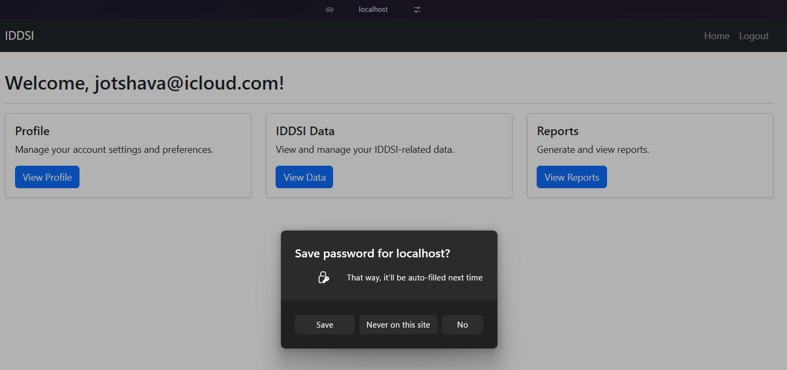

# IDDSI Authentication Microservice

A robust authentication microservice built with Spring Boot that provides secure user registration, email verification, and login functionality.

## Architecture

This microservice follows a layered architecture pattern:

- **Presentation Layer**: Thymeleaf templates for web interface
- **Service Layer**: Business logic implementation
- **Repository Layer**: Data access and persistence
- **Security Layer**: Spring Security for authentication and authorization

## Features

- User registration with email verification
- Secure login with Spring Security
- Email notifications using MailDev for development
- PostgreSQL database integration
- Responsive web interface using Bootstrap
- Protected dashboard for authenticated users

## Technology Stack

- **Backend Framework**: Spring Boot 6.2.6
- **Security**: Spring Security 6.4.5
- **Database**: PostgreSQL
- **Template Engine**: Thymeleaf 3.1.3
- **Email Testing**: MailDev
- **Frontend**: Bootstrap 5.3.0
- **Build Tool**: Maven

## Prerequisites

- Java 17 or higher
- PostgreSQL 12 or higher
- Maven 3.6 or higher
- Node.js (for MailDev)

## Installation

1. Clone the repository:
```bash
git clone https://github.com/JoTsav/IDDSI.git
cd IDDSI
```

2. Configure PostgreSQL:
   - Create a new database named `IDDSI-registration`
   - Update `application.yml` with your database credentials

3. Install MailDev:
```bash
npm install -g maildev
```

4. Build the application:
```bash
mvn clean install
```

## Configuration

### Database and Application Configuration
Update `src/main/resources/application.yml` with your settings:

```yaml
server:
  port: 8081
  error:
    include-message: always
    include-binding-errors: always

spring:
  datasource:
    password: your_password
    url: jdbc:postgresql://localhost:5432/IDDSI-registration
    username: your_username
    driver-class-name: org.postgresql.Driver
  jpa:
    hibernate:
      ddl-auto: create-drop # don't persist data
    properties:
      hibernate:
        dialect: org.hibernate.dialect.PostgreSQLDialect
        format_sql: true
    show-sql: true

  mail:
    host: localhost
    port: 1025
    username: hey
    password: hey
    properties:
      mail:
        smtp:
          ssl:
            trust: "*"
          auth: true
          starttls:
            enable: true
          connection timeout: 5000
          timeout: 3000
          write timeout: 5000
```

## Running the Application

1. Start MailDev:
```bash
maildev
```

2. Run the Spring Boot application:
```bash
mvn spring-boot:run
```

The application will be available at:
- Main application: http://localhost:8081
- MailDev interface: http://localhost:1080

## Application Flow

1. **Home Page** (Port 8081)
   - Landing page with sign-in option
   

2. **Registration**
   - User registration form
   - Successful registration confirmation
   

3. **Email Verification**
   - Verification email sent via MailDev
   
   - Email confirmation page
   

4. **Login**
   - Secure login form
   

5. **Dashboard**
   - Protected dashboard for authenticated users
   

## Security Features

- Password encryption using BCrypt
- CSRF protection
- Session management
- Email verification for new registrations
- Protected routes and resources

## API Endpoints

- `POST /api/v1/registration` - Register new user
- `GET /api/v1/registration/confirm` - Confirm email token
- `POST /login` - User authentication
- `POST /logout` - User logout
- `GET /dashboard` - Protected dashboard (requires authentication)

## Contributing

1. Fork the repository
2. Create your feature branch (`git checkout -b feature/AmazingFeature`)
3. Commit your changes (`git commit -m 'Add some AmazingFeature'`)
4. Push to the branch (`git push origin feature/AmazingFeature`)
5. Open a Pull Request

## Acknowledgments

- [MailDev](https://github.com/maildev/maildev.git) for email testing capabilities
- Spring Boot team for the excellent framework
- Bootstrap team for the responsive UI components

## Author

- **Jo Tsav** - [GitHub Profile](https://github.com/JoTsav)

## License

This project is licensed under the MIT License - see the LICENSE file for details. 